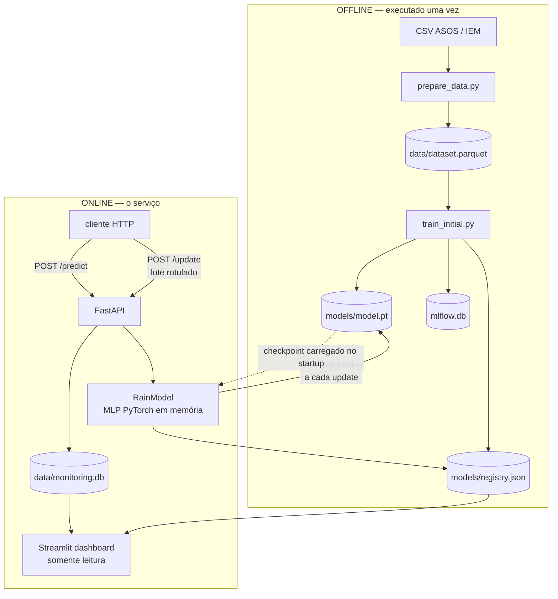

# 🌧️ Rain Prediction — sistema de predição de chuva com aprendizado incremental

Sistema de predição de chuva **com aprendizado incremental em produção**: uma API
serve previsões, recebe os rótulos verdadeiros quando eles ficam disponíveis e
**atualiza os pesos do modelo sem recriá-lo**, versionando cada atualização.

```
dados históricos → preparação → treino inicial (v1) → API → predição
      → rótulo chega depois → /update → nova versão → registry + monitoramento → dashboard
```

```bash
docker compose up --build
# API ......... http://localhost:8000/docs
# Dashboard ... http://localhost:8501
```

O `models/model.pt` está versionado no repositório, então a API sobe já com o
modelo carregado — não é preciso treinar antes para ver o sistema funcionando.

> **Escopo.** Demonstração local validada em Docker, feita para ilustrar um ciclo
> completo de ML/MLOps de ponta a ponta. Não é um sistema de previsão
> meteorológica pronto para produção, e não deve ser usado para decisões reais.

---

## O que o sistema faz

| Etapa | Onde | O que acontece |
|---|---|---|
| Preparação | `training/prepare_data.py` | CSV bruto do ASOS vira dataset horário com 16 features |
| Treino inicial (offline) | `training/train_initial.py` | Cria a **versão 1**: ajusta o scaler, treina a rede, calibra o limiar |
| Serviço | `app/main.py` | Carrega o checkpoint uma vez e serve `/predict` |
| Rótulo posterior | — | O rótulo só existe depois da hora prevista; chega em lote |
| Atualização (online) | `POST /update` | Avalia o lote, **depois** aprende com ele, incrementa a versão |
| Versionamento | `models/registry.json` | Uma entrada por versão, com métricas e `is_current` |
| Persistência | `models/model.pt`, `data/monitoring.db` | Checkpoint e histórico de eventos |
| Monitoramento | `dashboard/app.py` | Lê o SQLite e o registry, em modo somente leitura |
| Execução | `docker-compose.yml` | Dois contêineres: API e dashboard |
| Deploy | `render.yaml` | Blueprint da API (ainda não validado — ver abaixo) |

### Treino inicial e aprendizado incremental são coisas diferentes

Essa distinção é o centro do projeto:

| | Treino inicial (offline) | Aprendizado incremental (online) |
|---|---|---|
| Onde | `training/train_initial.py` | `POST /update` |
| Quando | Uma vez, para criar a v1 | Sempre que chega um lote rotulado |
| O que faz | Ajusta o scaler, calcula `pos_weight`, treina 30 épocas, calibra o limiar | Continua o treino por 2 épocas a `lr=1e-4` |
| O que preserva | — (cria do zero) | Pesos, estado do Adam, scaler e limiar |
| Resultado | `model.pt` v1 | `model.pt` v(N+1) |

O treino inicial não desaparece nem é substituído: ele é o que produz o primeiro
checkpoint, sem o qual não existe nada para atualizar.

---

## O problema

Prever se **vai chover na próxima hora** no aeroporto de Miami (estação ASOS
`MIA`), a partir de observações meteorológicas de superfície.

**Por que aprendizado incremental?** Dados climáticos mudam de comportamento ao
longo do tempo — sazonalidade, variações interanuais, mudanças de regime. Um
modelo treinado uma vez e nunca mais tocado vai operando sobre uma relação entre
variáveis que já não é a mesma. Neste dataset, a taxa de chuva caiu de cerca de
5,5% (2022–2024) para 3,8% em 2025.

O sistema responde a isso mantendo o modelo aprendendo enquanto serve: os rótulos
que chegam viram novos passos de gradiente sobre os pesos existentes.

O fenômeno é conhecido como *concept drift*. **O projeto não implementa detecção
de drift** — nem ADWIN, nem DDM, nem PSI. O monitoramento observa a distribuição
das probabilidades, que é o sinal disponível antes de os rótulos chegarem.

---

## Principais decisões técnicas

| Decisão | Alternativa descartada | Motivo |
|---|---|---|
| SQLite para monitoramento | Prometheus + Grafana | Uma instância, um worker, nenhum alerta. Dois contêineres a mais não se pagariam |
| `registry.json` | MLflow Model Registry | Evita que a API dependa de um servidor em tempo de execução |
| MLflow só offline | MLflow na imagem da API | Reduz a imagem; MLflow não é usado em runtime |
| `constants.py` como fonte única | Lista de features repetida por módulo | Ordem divergente entre treino e serving é um bug silencioso |
| torch CPU-only | `pip install torch` | A versão do PyPI passa de 2 GB por causa das libs CUDA |
| `--workers 1` | Múltiplos workers | O modelo é alterado in-place; workers teriam versões divergentes |
| Scaler congelado | Normalização adaptativa | Mudar a escala invalidaria os pesos aprendidos |
| Limiar calibrado em validação | Limiar fixo em 0,5 | Com 5% de positivos, 0,5 não é um corte razoável |
| Avaliar antes de treinar no `/update` | Medir depois | Medir depois mostraria o modelo acertando dados que acabou de ver |

---

## Arquitetura



Dois contêineres: `api` e `dashboard`. O dashboard lê o mesmo SQLite que a API
escreve, montado como somente leitura — se ele cair, o serviço não sente. Não há
chamada de rede entre os dois; o único contrato é o arquivo.

---

## Estrutura do projeto

```
.
├── app/                      # o serviço
│   ├── __init__.py
│   ├── constants.py          # fonte única: nomes e ordem das 16 features
│   ├── features.py           # limpeza e engenharia de features
│   ├── main.py               # FastAPI
│   ├── metrics.py            # métricas de classificação
│   ├── model.py              # RainModel: fit, incremental_fit, save, load
│   ├── registry.py           # versionamento operacional
│   ├── schemas.py            # validação Pydantic
│   └── storage.py            # SQLite de monitoramento
├── training/                 # offline
│   ├── prepare_data.py
│   ├── train_initial.py
│   └── simulate_production.py
├── dashboard/app.py          # Streamlit
├── tests/                    # 20 testes
│   ├── test_api.py
│   └── test_model.py
├── models/                   # model.pt + registry.json (versionados)
├── data/                     # dataset e SQLite (ignorados pelo Git)
│   └── .gitkeep              # mantém a pasta no clone; o bind mount precisa dela
├── Dockerfile                # API (torch CPU-only)
├── Dockerfile.dashboard
├── docker-compose.yml
├── render.yaml               # deploy da API (ainda não validado)
├── .dockerignore
├── .gitignore
├── requirements.txt          # dependências da API
└── requirements-train.txt    # + treino, testes e dashboard
```

---

## Dados

**Fonte:** [Iowa Environmental Mesonet](https://mesonet.agron.iastate.edu/request/download.phtml) —
observações ASOS/AWOS/METAR. O download é **manual**, pelo formulário do IEM.

Parâmetros usados para gerar o arquivo local:

| Campo | Valor |
|---|---|
| Estação | `MIA` |
| Período | 2012-01-01 a 2025-12-31 |
| Formato | CSV (`onlycomma`) |
| Fuso | UTC |
| Cabeçalho de colunas | sim |
| Valores ausentes | representação padrão (`M`) |
| Traço de precipitação | representação padrão (`T`) |

Variáveis a selecionar no download:

```
station  valid  tmpf  dwpf  relh  drct  sknt  p01i  mslp  vsby
```

Salve o arquivo em `data/MIA_2012_2025.csv`. Outro nome exige passar `--input`
para `prepare_data.py`.

As demais colunas (`wind_speed`, `wind_u`, `wind_v`, `dew_spread`,
`mslp_delta_3h`, `relh_delta_1h`, `rain_now`, `hour_sin`, `hour_cos`,
`month_sin`, `month_cos` e o alvo) são **derivadas pelo pipeline**, não baixadas.

> Diferenças de período, disponibilidade de campos ou regras de qualidade do CSV
> podem alterar o número de observações e, com ele, as métricas. Os números deste
> README foram obtidos com esse recorte e `seed = 42`.

### Números do dataset preparado

| | |
|---|---|
| Período usado | 2021–2025 |
| Observações | 43.624 (horárias) |
| Features | 16 |
| Taxa de positivos | 5,07% (1 chuva a cada ~19 horas) |

### Decisões de preparação

**Somente METAR de rotina (`minuto == 53`).** O ASOS emite relatórios de rotina
horários e relatórios especiais (SPECI), disparados quando o tempo muda —
inclusive quando começa a chover. Manter os SPECI faria a *quantidade* de
observações carregar informação sobre o alvo. Depois do filtro, cerca de 99,9%
dos intervalos são exatamente 1 hora, e a pressão (`mslp`) sai de 18 mil valores
ausentes para 71. O minuto 53 é específico da estação MIA.

**Alvo deslocado em 1 hora.** `rain_next_hour = p01i[t+1] >= 0.01`. Sem o
deslocamento, features e alvo seriam do mesmo instante e o modelo estaria
diagnosticando o presente, não prevendo o futuro. O alvo só é considerado válido
se a observação seguinte for de fato 1 hora depois.

**Vento decomposto em componentes.** Direção é circular: 359° e 1° são vizinhos
no céu, mas ficam nos extremos de uma escala numérica. `wind_u = -sknt·sin(θ)`,
`wind_v = -sknt·cos(θ)`. Os 4,6% de registros com direção variável mantêm a
velocidade e recebem `u = v = 0`, em vez de serem descartados (o que furaria os
lags).

**Tendências, não só níveis.** `mslp_delta_3h` (queda de pressão antecede chuva),
`relh_delta_1h`, `dew_spread` e os ciclos diurno e sazonal via `sin`/`cos` — pela
mesma razão do vento: hora 23 e hora 0 são adjacentes.

<details>
<summary>Lista completa das 16 features</summary>

`tmpf`, `dwpf`, `relh`, `mslp`, `vsby`, `wind_speed`, `wind_u`, `wind_v`,
`dew_spread`, `mslp_delta_3h`, `relh_delta_1h`, `rain_now`, `hour_sin`,
`hour_cos`, `month_sin`, `month_cos`

A ordem é definida em um único lugar (`app/constants.py`) e derivada dali pelo
scaler, pelo schema da API e pelos scripts de treino. Duas cópias divergentes
produziriam um vetor reordenado sem levantar erro nenhum.

Quatro features adicionais foram testadas (`rain_last_3h`, `vsby_delta_1h`,
`relh_delta_3h`, `vsby_min_3h`) e pioraram o F1 no conjunto de teste. Ficaram de
fora.
</details>

### Por que o alvo é desbalanceado, e o que se faz com isso

Chove em cerca de 5% das horas. Duas consequências:

- **Acurácia sozinha não diz nada.** Um modelo que responde "não vai chover"
  sempre acerta 95% das horas — e tem recall zero.
- **A loss precisa de peso.** `BCEWithLogitsLoss(pos_weight ≈ 18)` compensa o
  desbalanceamento sem reamostrar os dados. Sem isso, o gradiente é dominado
  pelos negativos e a rede converge para a resposta trivial.

Por isso a métrica principal é o **F1**, que só é alto quando precisão e recall
são altos ao mesmo tempo. A **ROC-AUC** mede outra coisa: a capacidade de ordenar
o risco, independente de qualquer limiar — é possível ter AUC alta e F1 baixo com
um limiar mal escolhido.

---

## Modelo

```
Entrada (16) → Linear(16) → ReLU → Linear(1) → logit
```

289 parâmetros. Treino completo em cerca de 4 segundos, atualização incremental
em milissegundos, checkpoint de 9,5 KB.

| Decisão | Escolha | Motivo |
|---|---|---|
| Saída | Logit (sigmoid só na inferência) | Permite `BCEWithLogitsLoss`, numericamente estável |
| Loss | `BCEWithLogitsLoss(pos_weight ≈ 18)` | Trata o desbalanceamento sem reamostrar |
| Otimizador | Adam | Estado salvo junto com os pesos |
| LR inicial / update | `1e-3` / `1e-4` | Update dez vezes menor, para não sobrescrever o aprendido |
| Épocas inicial / update | 30 / 2 | Poucas épocas no update evitam overfitting no lote recente |
| Limiar | 0,84, calibrado em validação | Nunca no conjunto de teste |

Os valores de `LR_UPDATE` e `EPOCHS_UPDATE` ficam em `app/model.py` e são os
defaults do endpoint `/update`. Ambos podem ser sobrescritos por requisição.

### Desempenho do modelo inicial

Treino em 2021–2022, limiar calibrado em 2023, avaliação em 2024–2025
(17.443 horas). O limiar nunca vê o conjunto de teste.

| | F1 | Precisão | Recall | ROC-AUC |
|---|---|---|---|---|
| **MLP (PyTorch)** | **0.535** | 0.545 | 0.526 | **0.893** |
| Persistência (referência) | 0.510 | 0.511 | 0.510 | 0.743 |

A linha de persistência ("se está chovendo agora, vai chover na próxima hora") é
uma **verificação de sanidade**, não uma estratégia alternativa: serve só para
dar escala ao número — sem ela, um F1 de 0,535 não diz se o modelo é bom ou se
empata com o palpite óbvio. A diferença mais relevante está na AUC: a
persistência só responde sim ou não, enquanto o modelo entrega uma probabilidade
que ordena o risco.

### Probabilidade, limiar e decisão

Três coisas diferentes, fáceis de confundir:

```
logit        saída crua da rede, em (-inf, +inf)
probability  sigmoid(logit), em [0, 1]
prediction   probability >= threshold, em {0, 1}
```

O `/predict` devolve `probability`, `threshold` e `prediction`, para que o cliente
possa aplicar o próprio corte se quiser ser mais ou menos conservador. Com limiar
em 0,84, uma probabilidade de 0,79 resulta em `prediction = 0`.

### Como o aprendizado incremental funciona aqui

Esta é a parte central do sistema. A diferença entre continuar treinando e
recomeçar do zero:

```python
# Isto parece incremental, mas cria um modelo novo
model = RainModel()            # __init__ reinicializa os pesos
optimizer = Adam(...)          # estado do otimizador zerado
model.fit(novos_dados)

# Isto é incremental
model = RainModel.load("model.pt")   # pesos + estado do Adam restaurados
model.incremental_fit(novos_dados)   # continua de onde parou
model.save("model.pt")               # versão incrementada
```

`fit` e `incremental_fit` chamam **o mesmo laço de treino**. Aprendizado
incremental não é um algoritmo diferente — é o mesmo passo de gradiente aplicado
sobre um estado preservado, com passo menor para não sobrescrever o que já
existia.

**Três coisas precisam sobreviver entre uma sessão e outra:**

1. **Os pesos** — óbvio, mas é o que muita implementação erra ao recriar a rede.
2. **O estado do otimizador** — o Adam guarda médias móveis dos gradientes
   (`exp_avg`, `exp_avg_sq`). Recarregar só os pesos e criar um Adam novo zera
   essas médias e torna os primeiros passos erráticos. É um bug silencioso: o
   modelo piora logo depois de ser carregado, sem motivo aparente.
3. **O scaler** — calculado uma vez e **congelado**. Os pesos foram aprendidos num
   espaço de features com determinada média e escala; se as estatísticas de
   normalização mudarem, esse espaço muda e os pesos deixam de valer. É a
   armadilha nº 1 de incremental learning com rede neural.

Tudo isso vive em um único `.pt` autocontido, junto com `feature_names` (que
elimina o bug clássico de ordem de colunas divergente entre treino e serving), o
limiar, a versão e o histórico. Salvar apenas o `state_dict()` da rede, como
muitos tutoriais fazem, bastaria para prever — mas quebraria a continuidade.

**O teste que prova a continuidade:**

```
tests/test_model.py::test_incremental_continues_from_saved_weights
```

Verifica que (1) os pesos recarregados são idênticos aos salvos via
`torch.equal`, (2) após um update eles mudam pouco, e (3) um modelo recriado do
zero fica muito mais distante do estado anterior do que a atualização incremental.

---

## Pré-requisitos

- Python 3.11
- Docker e Docker Compose (para o caminho recomendado)
- O CSV do IEM, se for rodar o pipeline de dados (ver [Dados](#dados))

---

## Instalação

```bash
python -m venv .venv && source .venv/bin/activate
pip install torch --index-url https://download.pytorch.org/whl/cpu
pip install -r requirements-train.txt
```

O torch é instalado à parte, do índice CPU-only. A versão do PyPI vem com as
bibliotecas CUDA e passa de 2 GB.

---

## Como executar

### Com Docker (recomendado)

```bash
docker compose up --build
```

- API: http://localhost:8000/docs
- Dashboard: http://localhost:8501

### Localmente, passo a passo

```bash
# 1. preparar os dados (o CSV do IEM vai em data/)
python -m training.prepare_data --input data/MIA_2012_2025.csv --start-year 2021

# 2. treinar o modelo inicial → cria a versão 1
python -m training.train_initial

# 3. subir a API (--reload já roda em um processo só, como no contêiner)
uvicorn app.main:app --reload

# 4. gerar tráfego e abrir o dashboard
python -m training.simulate_production --days 730 --in-process
streamlit run dashboard/app.py
```

> **Atenção no passo 4.** A simulação envia lotes rotulados para `/update`, o que
> **sobrescreve `models/model.pt`** (a versão avança) e adiciona entradas em
> `models/registry.json`. Se você pretende commitar o checkpoint do treino
> inicial, rode `python -m training.train_initial` novamente depois, ou use
> `--no-update` para apenas gerar predições.

### Testes

```bash
pytest tests/ -q
```

Os testes usam modelo, banco e registro temporários — nenhum artefato do
repositório é tocado.

---

## API

Documentação interativa em `http://localhost:8000/docs`.

| Endpoint | Método | Descrição |
|---|---|---|
| `/health` | GET | Verificação de vida: status, `model_loaded`, versão |
| `/model` | GET | Versão, nº de atualizações, limiar, nº de parâmetros |
| `/predict` | POST | Previsão para uma observação |
| `/update` | POST | Atualização incremental com lote rotulado (1 a 5.000 obs) |
| `/metrics` | GET | Métricas operacionais |
| `/versions` | GET | Histórico de versões do registry |

### Exemplo

```bash
curl -X POST http://localhost:8000/predict \
  -H "Content-Type: application/json" \
  -d '{
    "tmpf": 82.0, "dwpf": 75.0, "relh": 79.5, "mslp": 1012.5,
    "vsby": 10.0, "wind_speed": 8.0, "wind_u": -5.6, "wind_v": -5.6,
    "dew_spread": 7.0, "mslp_delta_3h": -1.2, "relh_delta_1h": 3.5,
    "rain_now": 0.0, "hour_sin": 0.5, "hour_cos": -0.866,
    "month_sin": -0.5, "month_cos": -0.866
  }'
```

```json
{
  "prediction": 0,
  "probability": 0.7935,
  "threshold": 0.84,
  "model_version": 1,
  "prediction_id": 1
}
```

O cliente envia o vetor de features já pronto, incluindo as derivadas
(`dew_spread`, `hour_sin`, ...). É o mesmo vetor que o modelo consome no treino,
o que torna a simulação de produção um replay direto do dataset. O custo é que o
cliente precisa saber calcular sin/cos — aceitar um timestamp e derivar no
servidor está em [próximos passos](#próximos-passos).

### `/update` — a ordem das operações importa

```
1. o modelo prevê sobre o lote  →  matriz de confusão registrada
2. só depois ele aprende com esses dados
3. checkpoint salvo com a versão incrementada
```

**Avaliar antes de aprender** é o que torna a métrica honesta: medir depois
mostraria o modelo acertando dados que acabou de estudar.

Lote é preferível a uma observação por vez: com 5% de positivos, um lote de
tamanho 1 quase nunca contém chuva e o gradiente resultante é ruído. Também é
realista — o rótulo só existe uma hora depois, então na prática se acumula.

`epochs` e `learning_rate` são opcionais. Omitidos, a API usa `EPOCHS_UPDATE = 2`
e `LR_UPDATE = 1e-4`. Esse learning rate conservador, dez vezes menor que o do
treino inicial, reduz o risco de um lote recente alterar demais os pesos já
aprendidos.

**A versão muda a cada update.** O checkpoint é salvo sempre no mesmo caminho
(`models/model.pt`), então só o estado mais recente existe em disco. O histórico
de como se chegou até ele vive em `models/registry.json` e na tabela `updates` do
SQLite.

### Liveness x readiness

`/health` responde **200 mesmo sem modelo carregado**, com `"status": "degraded"`
e `"model_loaded": false`. O `HEALTHCHECK` do Docker confirma apenas que o
processo HTTP responde (liveness); saber se o modelo está pronto (readiness) é
responsabilidade de quem lê o JSON. Se o checkpoint não existir, `/predict`,
`/model`, `/update` e `/metrics` retornam **503**.

Separar os dois em `/health` e `/ready` está em próximos passos — não é o
comportamento atual.

---

## Monitoramento

Toda predição e toda atualização são gravadas em SQLite. O dashboard Streamlit lê
o mesmo arquivo, em modo somente leitura.

**O que é monitorado:** volume de predições, distribuição das probabilidades,
taxa de positivos, número de atualizações, versão em uso e desempenho real
(quando lotes rotulados chegam via `/update`).

**Predições servidas e rótulos recebidos são coisas diferentes.** O rótulo de uma
previsão só existe uma hora depois dela, e neste desenho chega em lotes. Por isso
`/metrics` devolve `performance: null` até o primeiro `/update` — sem rótulo não
há acerto a medir, e devolver zeros pareceria um modelo ruim em vez de ausência
de medição.

A **distribuição das probabilidades** é o sinal mais útil enquanto isso: um
deslocamento nela indica mudança nos dados de entrada ou no modelo *sem precisar
esperar pelos rótulos*.

O dashboard usa cache de 10 segundos (`st.cache_data(ttl=10)`). Isso é expiração
de cache, **não atualização automática**: o Streamlit só busca dados novos quando
o script reexecuta, o que acontece na interação ou ao recarregar a página.

### Por que não Prometheus + Grafana

Prometheus resolve agregação entre múltiplas instâncias, retenção de séries
temporais e alertas. Este sistema tem **uma instância, um worker e nenhum
alerta**. SQLite responde às mesmas perguntas com uma dependência que já vem no
Python, e é lido diretamente pelo dashboard. É adequado para demonstração local e
baixa concorrência; com várias instâncias escrevendo, a escolha seria outra.

### Simulação de produção validada

Replay do dataset contra a API, hora a hora, com os rótulos chegando em lote —
exatamente como chegariam em operação real, com atraso.

```bash
python -m training.simulate_production \
  --start 2024-01-01 \
  --days 730 \
  --update-every-days 30 \
  --in-process
```

Resultado da execução validada:

| | |
|---|---|
| Período | 2024-01-01 a 2025-12-30 |
| Predições servidas | 17.443 |
| Atualizações incrementais | 24 |
| Versão final do modelo | **v25** |
| Rótulos recebidos | 17.205 |
| Probabilidade média | 0,2898 |
| F1 acumulado | 0,535 |
| Precisão | 0,540 |
| Recall | 0,530 |

> Estes números são de um **replay histórico de demonstração**. Eles mostram que o
> ciclo completo funciona de ponta a ponta — predição, chegada do rótulo,
> atualização, versionamento, persistência — e não constituem garantia de
> desempenho futuro em dados novos.

**Como ler esses números:**

*24 atualizações, versão final v25.* São 730 dias divididos em janelas de 30 dias
corridos, cada uma disparando um `/update` que incrementa a versão a partir da v1
criada no treino inicial.

*17.443 predições contra 17.205 rótulos.* A diferença de 238 são as horas do
último período, ainda no buffer quando a simulação terminou. É o comportamento
correto: o rótulo de uma previsão só existe depois, e quem ainda não fechou uma
janela de 30 dias não foi enviado para o `/update`.

*F1 acumulado de 0,535.* O número coincide com o do conjunto de teste offline
porque o replay percorre **o mesmo período**, 2024–2025. As duas medições não são
evidências independentes uma da outra: a offline avalia o modelo v1 de uma vez, a
operacional avalia lote a lote com o modelo evoluindo de v1 a v25. Que cheguem ao
mesmo lugar indica que as atualizações não degradaram o modelo ao longo de dois
anos de replay — não que ele generalize para dados fora desse período.

*Probabilidade média de 0,2898 contra limiar de 0,84.* Coerente com um alvo em que
chove em ~5% das horas: a maior parte das saídas fica bem abaixo do corte.

**Sobre o intervalo.** São **30 dias corridos** (padrão), contados a partir do
update anterior — não é fim de mês-calendário. `--update-every-days` controla com
que frequência o modelo aprende; `--no-update` gera apenas predições, sem tocar no
checkpoint.

O F1 medido lote a lote oscila bastante: períodos sem chuva produzem F1 igual a
zero por ausência de positivos, não por falha do modelo. É por isso que o
dashboard mostra o acumulado *e* o valor por lote.

---

## MLflow

Usado para **tracking do treinamento inicial**: parâmetros, métricas e o
checkpoint de cada run, com backend SQLite local.

```bash
mlflow ui --backend-store-uri sqlite:///mlflow.db
```

> O file store (`./mlruns`) entrou em modo de manutenção no MLflow 3.x. A maioria
> dos tutoriais ainda usa esse caminho; este projeto usa SQLite, que continua
> sendo um arquivo local, sem servidor.

**O Model Registry do MLflow não é usado**, por decisão de escopo. Ele exigiria um
servidor rodando e faria a API depender dele em tempo de execução — se o MLflow
cai, a API cai junto. Aqui o modelo em produção é um arquivo `.pt`, e as perguntas
relevantes (qual versão está no ar, quando foi criada, com que desempenho) são
respondidas por `models/registry.json`, legível por humanos.

As três camadas de estado, para não confundir:

| Arquivo | Papel |
|---|---|
| `mlflow.db` | Runs do treino inicial: params, métricas, artefatos |
| `models/registry.json` | Histórico operacional de versões; `is_current` marca a ativa |
| `data/monitoring.db` | Eventos de runtime: predições, updates e avaliações |

No `registry.json`, o campo `metrics` de uma entrada `incremental_update` contém
as métricas medidas no lote **antes** do treino — ou seja, descrevem a versão
anterior sobre aqueles dados, não o modelo depois de aprender. O campo `notes`
repete isso em texto.

Consequência prática: **MLflow não está no `requirements.txt` da API**, apenas no
`requirements-train.txt`. A imagem do serviço não carrega o que não usa.

---

## Docker Compose

```bash
docker compose up -d --build --wait
docker compose ps
```

Dois serviços, portas 8000 (API) e 8501 (dashboard). Os bind mounts `./models` e
`./data` persistem o modelo atualizado e o banco de monitoramento fora dos
contêineres — sem eles, tudo que o `/update` gravou desapareceria a cada restart.
O dashboard monta os dois em modo somente leitura.

Os health checks vêm das imagens, o que faz `--wait` esperar de fato os dois
serviços ficarem prontos.

---

## Validações realizadas

Validado localmente, com execução manual:

- [x] Preparação de dados e treino inicial concluídos
- [x] `models/model.pt` e `models/registry.json` gerados
- [x] MLflow registrando os runs do treino inicial
- [x] API local, Swagger em `/docs`, todos os seis endpoints respondendo
- [x] SQLite `monitoring.db` criado e alimentado
- [x] Simulação de produção de 730 dias: 17.443 predições, 24 atualizações
      incrementais, modelo avançando de v1 a v25
- [x] Dashboard Streamlit funcionando
- [x] Suíte de testes passando
- [x] `docker compose config --quiet` sem erros; serviços `api` e `dashboard`
- [x] API Docker com `torch 2.5.1+cpu`, rodando como `appuser` (não root)
- [x] API e dashboard `healthy` no Compose
- [x] Persistência confirmada após `docker compose down` / `up`
- [x] Dashboard Docker lendo `monitoring.db` e `registry.json` corretamente
- [x] Predição nova via API refletida no dashboard

**Ainda não validado:** deploy na Render.

---

## Deploy na Render

O `render.yaml` está preparado, mas **ainda não foi validado por um deploy real em
nuvem**. O que foi validado até aqui é a execução local via Docker Compose.

Quando for feito, valem estas condições:

- O blueprint cobre **apenas a API**; o dashboard não é publicado por ele.
- A porta vem da variável `PORT` injetada pela plataforma, com fallback local para
  8000 (`${PORT:-8000}` no `CMD` do Dockerfile).
- `healthCheckPath` é `/health`.
- O plano gratuito tem 512 MB de RAM e hiberna após 15 minutos sem tráfego.
- **O filesystem é efêmero.** `model.pt`, `registry.json` e `monitoring.db` voltam
  ao estado da imagem a cada restart ou deploy. Na nuvem, o `/update` demonstra o
  ciclo, mas **não é persistência durável de aprendizado incremental**. Persistir
  de verdade exigiria volume pago ou object storage.

---

## Limitações

**As probabilidades não são calibradas em termos absolutos.** O `pos_weight`
desloca a escala: "0,84" não significa 84% de chance de chover. O modelo ordena o
risco bem (AUC 0,893), mas para leitura direta da probabilidade seria necessária
uma calibração posterior (Platt scaling ou isotônica).

**Uma única estação.** Miami tem um regime tropical bastante específico. Os
resultados não se transferem automaticamente para outros climas.

**Um único worker.** O modelo vive na memória do processo e é alterado in-place
pelo `/update`. Com múltiplos workers, cada processo teria a própria cópia do
checkpoint e responderia com pesos diferentes. Escalar exigiria separar leitura de
escrita: várias réplicas servindo `/predict` a partir de um checkpoint
compartilhado e um processo único responsável pelas atualizações.

**`/predict` não adquire o lock.** Só `/update` serializa, porque é ele que altera
pesos e estado do otimizador. Uma predição concorrente com uma atualização pode
ler um estado intermediário da rede — não corrompe nada, mas é um trade-off aceito
conscientemente para não serializar toda leitura.

**SQLite é adequado para demonstração local e baixa concorrência.** Ele serializa
escritas; com várias instâncias, seria preciso outra solução.

**Não há detecção automática de drift.** O monitoramento expõe a distribuição das
probabilidades, mas nada dispara alerta ou retreino sozinho.

**Lags assumem espaçamento horário.** `mslp_delta_3h` usa `shift(3)`, que conta
linhas, não horas. Nos ~0,1% de pontos com buraco na série, "3 linhas atrás" não é
"3 horas atrás". O alvo é protegido contra isso; os lags não são.

**Métricas por lote pequeno oscilam muito.** Períodos sem chuva produzem F1 igual
a zero por ausência de positivos, não por falha do modelo.

---

## Próximos passos

- Deploy na Render e validação do comportamento em filesystem efêmero
- Calibração de probabilidade (Platt/isotônica) para tornar a saída interpretável
- Endpoint `/ready` separado de `/health`, ou healthcheck exigindo `model_loaded`
- Aceitar `timestamp` no `/predict` e derivar sin/cos no servidor
- Separação leitura/escrita para permitir múltiplos workers
- CI no GitHub Actions rodando os testes a cada push
- Download automatizado do CSV via API do IEM

---

## Como reproduzir

```bash
# 1. baixe o CSV do IEM com os parâmetros da seção "Dados"
#    e salve em data/MIA_2012_2025.csv

# 2. ambiente
python -m venv .venv && source .venv/bin/activate
pip install torch --index-url https://download.pytorch.org/whl/cpu
pip install -r requirements-train.txt

# 3. dataset (confira a taxa de positivos no relatório impresso: ~5,07%)
python -m training.prepare_data --input data/MIA_2012_2025.csv --start-year 2021

# 4. treino inicial → tabela "Desempenho do modelo inicial"
python -m training.train_initial

# 5. ciclo incremental completo
python -m training.simulate_production \
  --start 2024-01-01 --days 730 --update-every-days 30 --in-process

# 6. monitoramento
streamlit run dashboard/app.py
```

Todos os passos usam `seed = 42`. Divergências no CSV de origem (período, campos,
regras de qualidade do IEM) alteram o número de observações e, com ele, as
métricas.

---

## Origem do projeto

O projeto surgiu de uma investigação sobre adaptação de modelos a dados temporais
e foi evoluído para uma aplicação implantável de predição de chuva com
aprendizado incremental.

Na transformação, o alvo passou a ser a chuva na próxima hora (e não na hora
corrente), o conjunto de features cresceu de 5 para 16, o modelo migrou para uma
rede em PyTorch e o resultado deixou de ser uma análise exploratória para virar
um serviço com API, versionamento, monitoramento e empacotamento em contêiner.

---

## Licença

Licença ainda não definida. Enquanto não houver um arquivo `LICENSE` na raiz,
todos os direitos permanecem reservados.

Os dados meteorológicos são de domínio público, obtidos do Iowa Environmental
Mesonet.
