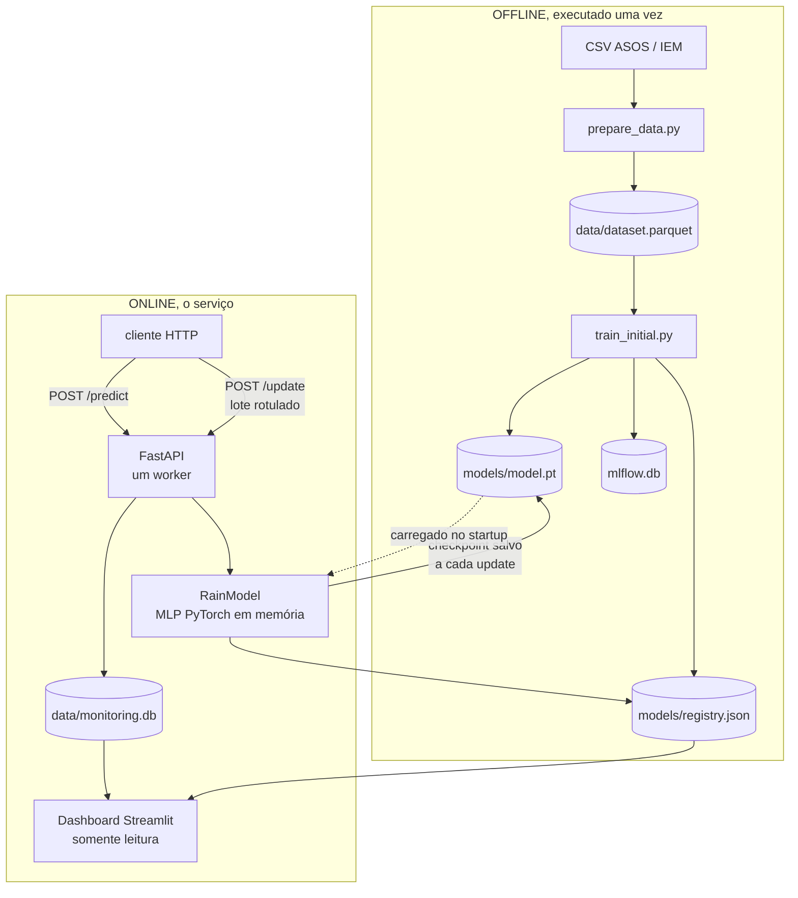

# 🌧️ Rain Prediction: previsão de chuva com aprendizado incremental

Sistema que prevê chuva na próxima hora e **demonstra atualização incremental após o modelo ser colocado em serviço**. A API serve previsões, recebe os rótulos verdadeiros quando eles ficam disponíveis e atualiza os pesos do modelo sem recriá-lo. Pesos, estado do Adam, scaler e limiar são preservados entre as atualizações, e cada atualização é versionada.

**Tecnologias:** `PyTorch` · `FastAPI` · `SQLite` · `Streamlit` · `MLflow` · `Docker Compose`

> **Escopo e limitações principais**
>
> * Demonstração local, validada em Docker, de um ciclo completo de ML/MLOps.
> * **Não é um sistema meteorológico operacional nem foi validado para decisões reais.**
> * O deploy na Render está preparado, mas **ainda não foi validado por um deploy real em nuvem**.
> * O replay operacional percorre o mesmo período do teste offline, portanto **não é evidência independente de generalização**.

<!-- adicionar screenshot ou GIF do dashboard Streamlit aqui -->

<!-- adicionar screenshot do Swagger em /docs aqui -->

---

## Resultado em números

O README separa três coisas: **avaliação offline do modelo inicial**, **replay operacional** e **demonstração de versionamento, persistência e monitoramento**.

### Dados

Estação MIA, em Miami · [Iowa Environmental Mesonet](https://mesonet.agron.iastate.edu/request/download.phtml) · 2021 a 2025

| | |
|---|---|
| Observações horárias | 43.624 |
| Features | 16 |
| Taxa de positivos | 5,07% |

### Avaliação offline do modelo inicial

Teste em 2024 e 2025, limiar calibrado em 2023 e conjunto de teste usado uma única vez.

| | F1 | Precisão | Recall | ROC AUC |
|---|---:|---:|---:|---:|
| **MLP, PyTorch** | **0,535** | 0,545 | 0,526 | **0,893** |
| Persistência, referência | 0,510 | 0,511 | 0,510 | 0,743 |

### Replay operacional

Replay de 730 dias contra a API, com os rótulos chegando em lote.

| | |
|---|---:|
| Predições servidas | 17.443 |
| Atualizações incrementais | 24 |
| Versão final do modelo | **v25** |
| Rótulos recebidos | 17.205 |
| Probabilidade média | 0,2898 |
| F1, Precisão e Recall | 0,535 · 0,540 · 0,530 |

> O replay percorre **2024 e 2025, o mesmo período do teste offline**. As duas medições não são independentes. O replay demonstra que o ciclo funciona de ponta a ponta, mas não que o modelo generalize para dados novos.

### Versionamento, persistência e monitoramento

O modelo avançou de v1 a v25, com uma entrada por versão em `models/registry.json` e eventos em `data/monitoring.db`. Com os bind mounts do Compose, o checkpoint atualizado e o histórico sobrevivem a `docker compose down` e `up`. Isso é persistência local. Na Render, o filesystem do plano gratuito é efêmero.

---

## Execução rápida

```bash
docker compose up -d --build --wait
docker compose ps
```

O segundo comando confirma o estado dos serviços, incluindo `healthy` quando os healthchecks terminam.

* API e Swagger: [localhost:8000/docs](http://localhost:8000/docs)
* Dashboard: [localhost:8501](http://localhost:8501)

`models/model.pt` está versionado no repositório. A API sobe já com o modelo carregado. **Não é preciso treinar nem baixar dados** para a primeira execução.

> ⚠️ O replay operacional **modifica artefatos do repositório**: `models/model.pt`, cuja versão avança, `models/registry.json`, que ganha uma entrada por atualização, e `data/monitoring.db`. Para commitar o checkpoint do treino inicial, rode `python -m training.train_initial` novamente depois, ou use `--no-update`.

---

## O problema

Prever se **vai chover na próxima hora** a partir de observações de superfície: temperatura, ponto de orvalho, umidade, pressão, visibilidade e vento.

**O alvo é desbalanceado.** Chove em cerca de 5% das horas. Isso inviabiliza a acurácia como métrica. Um modelo que responde “não vai chover” sempre acerta 95% das horas e tem recall zero. A métrica principal é o **F1**, que só é alto quando precisão e recall são altos ao mesmo tempo. Na loss, `BCEWithLogitsLoss(pos_weight ≈ 18)` compensa o desbalanceamento sem reamostrar. Sem isso, o gradiente é dominado pelos negativos e a rede converge para a resposta trivial.

**Por que aprendizado incremental?** Dados climáticos mudam de comportamento ao longo do tempo. Neste dataset, a taxa de chuva caiu de cerca de 5,5% entre 2022 e 2024 para 3,8% em 2025. Um modelo treinado uma vez opera sobre uma relação entre variáveis que pode deixar de valer.

O fenômeno é conhecido como *concept drift*. **O projeto não implementa detecção de drift**, como ADWIN, DDM ou PSI. Ele demonstra o mecanismo de atualização. A decisão sobre quando atualizar fica fora do escopo.

---

## Solução e fluxo do sistema

```text
dados históricos → preparação → treino inicial, v1 → API → predição
      → rótulo chega depois → /update → nova versão
      → registry e monitoramento → dashboard
```

| Etapa | Onde | O que acontece |
|---|---|---|
| Preparação | `training/prepare_data.py` | CSV bruto do ASOS vira dataset horário com 16 features |
| Treino inicial | `training/train_initial.py` | Cria a **v1**, ajusta o scaler, treina a rede e calibra o limiar |
| Serviço | `app/main.py` | Carrega o checkpoint uma vez e serve `/predict` |
| Rótulo posterior | Não se aplica | O rótulo só existe depois da hora prevista e chega em lote |
| Atualização | `POST /update` | Avalia o lote, depois aprende com ele e incrementa a versão |
| Versionamento | `models/registry.json` | Uma entrada por versão, com métricas e `is_current` |
| Persistência | `models/model.pt`, `data/monitoring.db` | Checkpoint e histórico de eventos |
| Monitoramento | `dashboard/app.py` | Lê o SQLite e o registry em modo somente leitura |
| Execução | `docker-compose.yml` | Dois contêineres, API e dashboard |

---

## Arquitetura



São dois contêineres independentes. O dashboard lê os mesmos arquivos que a API escreve, montados como somente leitura. **Não há chamada de rede entre os dois**. O único contrato é o arquivo. Se o dashboard cair, a API não sente.

---

## Treino inicial e aprendizado incremental

Essa distinção é o centro do projeto.

| | Treino inicial, offline | Incremental, online |
|---|---|---|
| Onde | `training/train_initial.py` | `POST /update` |
| Quando | Uma vez, cria a v1 | A cada lote rotulado |
| O que faz | Ajusta o scaler, calcula `pos_weight`, treina 30 épocas e calibra o limiar | Continua o treino por 2 épocas a `lr=1e-4` |
| O que preserva | Cria do zero | Pesos, estado do Adam, scaler e limiar |
| Resultado | `model.pt`, v1 | `model.pt`, v(N+1) |

O treino inicial não é substituído pelo incremental. Ele produz o primeiro checkpoint, sem o qual não existe nada para atualizar.

```python
# Recomeça do zero. Pesos e estado do Adam são reinicializados.
model = RainModel()
model.fit(novos_dados)

# Continua a partir do estado salvo. Pesos, Adam e scaler são preservados.
model = RainModel.load("model.pt")
model.incremental_fit(novos_dados)
model.save("model.pt")
```

`fit` e `incremental_fit` chamam o mesmo laço de treino. Aprendizado incremental não é outro algoritmo. É o mesmo passo de gradiente sobre um estado preservado, com passo menor para não sobrescrever o que já existia.

### Três coisas precisam sobreviver entre uma sessão e outra

1. **Os pesos.** São perdidos quando a rede é recriada.
2. **O estado do otimizador.** O Adam guarda médias móveis dos gradientes, como `exp_avg` e `exp_avg_sq`. Criar um Adam novo zera essas médias e pode tornar os primeiros passos erráticos.
3. **O scaler.** É ajustado uma vez no treino inicial e permanece **congelado**. Os pesos foram aprendidos em um espaço de features com determinada média e escala. Recalcular as estatísticas muda esse espaço e invalida os pesos existentes.

Nenhum desses erros necessariamente levanta uma exceção. O modelo pode apenas piorar depois de ser carregado. Tudo isso vive em um único `.pt` de 9,5 KB, junto com os nomes das features, o limiar, a versão e o histórico.

O teste `tests/test_model.py::test_incremental_continues_from_saved_weights` **verifica a continuidade do estado salvo**. Os pesos recarregados são idênticos aos salvos, mudam pouco após um update e ficam mais próximos do estado anterior do que os pesos de um modelo recriado do zero.

> O projeto demonstra a **implementação** do ciclo incremental. Não afirma que aprendizado incremental seja sempre superior a retreinamento periódico. Essa comparação está fora do escopo.

---

## Modelo e validação

```text
Entrada, 16 → Linear(16) → ReLU → Linear(1) → logit
```

289 parâmetros. Treino completo em cerca de 4 segundos. Atualização incremental em milissegundos.

| Decisão | Escolha | Motivo |
|---|---|---|
| Saída | Logit, sigmoid só na inferência | Permite `BCEWithLogitsLoss`, numericamente estável |
| Loss | `BCEWithLogitsLoss(pos_weight ≈ 18)` | Trata o desbalanceamento sem reamostrar |
| Otimizador | Adam | Estado salvo junto com os pesos |
| LR inicial e update | `1e-3` e `1e-4` | Update dez vezes menor, para não sobrescrever o aprendido |
| Épocas inicial e update | 30 e 2 | Poucas épocas no update evitam overfitting no lote recente |
| Limiar | 0,84, calibrado na validação | 0,5 não é corte razoável com 5% de positivos |

**Logit, probabilidade e decisão são três coisas diferentes:**

```text
logit        saída crua da rede, em (-inf, +inf)
probability  sigmoid(logit), em [0, 1]
prediction   probability >= threshold, em {0, 1}
```

Com limiar em 0,84, uma probabilidade de 0,79 resulta em `prediction = 0`.

### Divisão temporal

| Conjunto | Período | Uso |
|---|---|---|
| Treino | 2021 e 2022 | Aprende os pesos |
| Validação | 2023 | Calibra o limiar de decisão |
| Teste | 2024 e 2025 | Avaliação final, usada uma única vez |

**Por que não usar split aleatório?** Embaralhar colocaria julho de 2025 no treino e junho de 2025 no teste. Como observações próximas são correlacionadas, o split permitiria que informações muito semelhantes aparecessem nos dois conjuntos, produzindo uma estimativa otimista de desempenho.

**Por que calibrar o limiar na validação?** Escolhê-lo olhando o teste transformaria o teste em treino e inflaria o resultado final.

**Sobre a baseline de persistência**, que responde “se está chovendo agora, vai chover na próxima hora”: é uma **verificação de sanidade**, não uma estratégia alternativa. Sem ela, um F1 de 0,535 não diz se o modelo é bom ou se empata com o palpite óbvio. Além do F1 ligeiramente superior, a diferença mais expressiva aparece na ROC AUC, com 0,893 contra 0,743. A persistência só responde sim ou não, enquanto o modelo entrega uma saída contínua que ordena o risco.

---

## API

Documentação interativa em [localhost:8000/docs](http://localhost:8000/docs).

| Endpoint | Descrição |
|---|---|
| `GET /health` | Status, `model_loaded`, versão |
| `GET /model` | Versão, número de atualizações, limiar e número de parâmetros |
| `POST /predict` | Previsão para uma observação |
| `POST /update` | Atualização incremental com lote rotulado, de 1 a 5.000 observações |
| `GET /metrics` | Métricas operacionais |
| `GET /versions` | Histórico de versões do registry |

```bash
curl -X POST http://localhost:8000/predict \
  -H "Content-Type: application/json" \
  -d '{
    "tmpf": 82.0, "dwpf": 75.0, "relh": 79.5, "mslp": 1012.5,
    "vsby": 10.0, "wind_speed": 8.0, "wind_u": -5.6, "wind_v": -5.6,
    "dew_spread": 7.0, "mslp_delta_3h": -1.2, "relh_delta_1h": 3.5,
    "rain_now": 0.0, "hour_sin": 0.5, "hour_cos": -0.866,
    "month_sin": -0.5, "month_cos": -0.866
  }'
```

```json
{
  "prediction": 0,
  "probability": 0.7935,
  "threshold": 0.84,
  "model_version": 1,
  "prediction_id": 1
}
```

A resposta devolve probabilidade, limiar e decisão para que o cliente possa aplicar o próprio corte. O cliente envia o vetor de features já pronto, incluindo as derivadas. É o mesmo vetor que o modelo consome no treino, o que torna o replay um envio direto do dataset.

### `/update`: a ordem das operações importa

1. O modelo avalia o lote **com o estado anterior**.
2. A matriz de confusão é registrada na tabela `evaluations`.
3. O modelo aprende com o lote.
4. A versão é incrementada.
5. O checkpoint é salvo em `models/model.pt`.
6. O registry e o SQLite são atualizados.

Avaliar antes de aprender torna a métrica honesta. Medir depois mostraria o modelo acertando dados que acabou de estudar.

> **As métricas de um lote descrevem a versão anterior**, não o modelo depois de treinar naquele lote. A avaliação é associada à `model_version` que gerou as predições. Isso vale para `metrics_before_update` na resposta HTTP e para o campo `metrics` da entrada correspondente no `registry.json`. O campo `notes` repete esse aviso.

Lote é preferível a uma observação por vez. Com 5% de positivos, um lote de tamanho 1 quase nunca contém chuva e o gradiente resultante é ruído. Também é mais realista, pois o rótulo só existe depois da hora prevista e, na prática, é acumulado.

O checkpoint é salvo sempre no mesmo caminho, então apenas o estado mais recente existe em disco. O histórico de como se chegou até ele vive no `registry.json` e na tabela `updates`.

### Liveness e readiness

`/health` responde **200 mesmo sem modelo carregado**, com `"status": "degraded"` e `"model_loaded": false`. O healthcheck do Docker confirma apenas que o processo HTTP responde. Isso é **liveness, não readiness**. Sem checkpoint, `/predict`, `/model`, `/update` e `/metrics` retornam **503**.

---

## Monitoramento e versionamento

O SQLite registra três tipos de evento: **predições** servidas, **atualizações** do modelo e **avaliações** de lotes rotulados. O dashboard Streamlit lê esse arquivo e o `registry.json` diretamente. **Não chama a API.**

* **`performance` é `null` até o primeiro `/update`.** Sem rótulo não há acerto a medir. Devolver zeros pareceria um modelo ruim em vez de ausência de medição.
* **Predições servidas e rótulos recebidos são coisas diferentes.** O rótulo de uma previsão só existe depois da hora prevista e aqui chega em lotes.
* **A distribuição das probabilidades é um sinal operacional.** Um deslocamento nessa distribuição pode sinalizar mudança nos dados de entrada, no comportamento do modelo ou na política de atualização. O projeto não calcula um teste estatístico de drift, nem dispara alerta ou retreinamento.
* **`st.cache_data(ttl=10)` é expiração de cache, não atualização automática.** O Streamlit só busca dados novos quando o script é executado novamente, por interação ou recarregamento da página.

### Três camadas de estado

| Arquivo | Papel |
|---|---|
| `mlflow.db` | Runs do treino inicial, com parâmetros, métricas e artefatos |
| `models/registry.json` | Histórico operacional de versões. `is_current` marca a ativa |
| `data/monitoring.db` | Eventos de runtime, com predições, updates e avaliações |

**MLflow é usado apenas para tracking offline** do treino inicial e fica fora do `requirements.txt` da API.

```bash
mlflow ui --backend-store-uri sqlite:///mlflow.db
```

**O Model Registry do MLflow não é usado.** Ele exigiria um servidor rodando e faria a API depender dele em tempo de execução. Aqui o modelo é um arquivo `.pt`, e as perguntas relevantes sobre a versão ativa, sua criação e seu desempenho são respondidas por um JSON legível por humanos.

**Por que não Prometheus e Grafana?** Eles resolvem agregação entre múltiplas instâncias, retenção de séries temporais e alertas. Este sistema tem uma instância, um worker e nenhum alerta. SQLite responde às perguntas necessárias com uma dependência que já vem no Python e é lida diretamente pelo dashboard.

---

## Replay operacional

Replay do dataset contra a API, hora a hora, com os rótulos chegando em lote, como chegariam em uma operação real, com atraso.

```bash
python -m training.simulate_production \
  --start 2024-01-01 \
  --days 730 \
  --update-every-days 30 \
  --in-process
```

| Período | Predições | Updates | Versão final | Rótulos | Prob. média | F1 | Precisão | Recall |
|---|---:|---:|---:|---:|---:|---:|---:|---:|
| 2024-01-01 a 2025-12-30 | 17.443 | 24 | **v25** | 17.205 | 0,2898 | 0,535 | 0,540 | 0,530 |

**Como ler os números:**

* **24 updates, v25.** São 730 dias em janelas de 30 dias corridos, não meses-calendário. Cada janela dispara um `/update` a partir da v1.
* **17.443 predições contra 17.205 rótulos.** A diferença de 238 são as horas do último período, ainda no buffer quando o replay terminou. Quem não fechou uma janela de 30 dias não foi enviado ao `/update`.
* **F1 de 0,535 coincide com o teste offline** porque o replay percorre o mesmo período, 2024 e 2025. **As duas medições não são independentes:** a offline avalia o modelo v1 de uma vez; a operacional avalia lote a lote, com o modelo evoluindo de v1 a v25. Chegar ao mesmo lugar indica que as atualizações não degradaram o modelo ao longo do replay. Não indica generalização para fora desse período.
* **Probabilidade média de 0,2898 contra limiar de 0,84.** A média fica abaixo do corte, como esperado em um cenário com poucos eventos positivos. Ela **não deve ser interpretada como a prevalência de chuva**, porque as saídas não estão calibradas como probabilidades absolutas.

`--update-every-days` controla a frequência das atualizações. `--no-update` gera apenas predições, sem tocar no checkpoint.

O F1 medido lote a lote oscila bastante. Períodos sem chuva produzem F1 igual a zero por ausência de positivos, não necessariamente por falha do modelo. Por isso o dashboard mostra o acumulado e o valor por lote.

---

## Reprodução do pipeline completo

```bash
# 1. Baixe o CSV do IEM conforme os parâmetros em "Fonte dos dados"
#    e salve em data/MIA_2012_2025.csv.

# 2. Crie o ambiente. O torch é instalado separadamente pelo índice CPU-only.
python -m venv .venv && source .venv/bin/activate
pip install torch --index-url https://download.pytorch.org/whl/cpu
pip install -r requirements-train.txt

# 3. Prepare o dataset.
python -m training.prepare_data \
  --input data/MIA_2012_2025.csv \
  --start-year 2021

# 4. Treine o modelo inicial e crie a v1.
python -m training.train_initial
```

Em terminais separados, execute a API, o replay e o dashboard:

```bash
# Terminal 1
uvicorn app.main:app --reload
```

```bash
# Terminal 2
python -m training.simulate_production \
  --start 2024-01-01 \
  --days 730 \
  --update-every-days 30 \
  --in-process
```

```bash
# Terminal 3
streamlit run dashboard/app.py
```

Python 3.11 e `seed = 42`. Divergências no CSV de origem, como período, campos ou regras de qualidade do IEM, alteram o número de observações e, com ele, as métricas.

---

## Testes e validações

```bash
pytest tests/ -q     # 20 testes
```

Cada teste roda contra modelo, banco e registro temporários. Nenhum artefato do repositório é tocado.

Validado localmente, com execução manual: pipeline de dados, treino inicial, MLflow registrando os runs, seis endpoints respondendo com Swagger em `/docs`, SQLite alimentado, replay de 730 dias, da v1 à v25, dashboard funcionando, suíte de testes passando, `docker compose config --quiet` sem erros, imagem da API com `torch 2.5.1+cpu` rodando como `appuser`, não root, ambos os serviços `healthy` no Compose, persistência confirmada após `down` e `up` e predição nova refletida no dashboard.

**Ainda não validado:** deploy na Render.

---

## Decisões técnicas principais

| Decisão | Alternativa descartada | Motivo |
|---|---|---|
| SQLite para monitoramento | Prometheus e Grafana | Uma instância, um worker e nenhum alerta |
| `registry.json` | MLflow Model Registry | Evita que a API dependa de um servidor em runtime |
| MLflow somente offline | MLflow na imagem da API | Reduz a imagem, pois não é usado em runtime |
| Fonte única das features | Lista repetida por módulo | Ordem divergente entre treino e serving é um bug silencioso |
| torch CPU-only | `pip install torch` | A versão do PyPI passa de 2 GB por causa das bibliotecas CUDA |
| `--workers 1` | Múltiplos workers | O modelo é alterado in-place e workers teriam versões divergentes |
| Scaler congelado | Normalização adaptativa | Mudar a escala invalidaria os pesos aprendidos |
| Limiar calibrado na validação | Limiar fixo em 0,5 | Com 5% de positivos, 0,5 não é um corte razoável |
| Avaliação antes do treino | Medição depois do update | Medir depois mostraria o modelo acertando dados já vistos |

**Docker Compose.** São dois serviços nas portas 8000 e 8501, com healthchecks nas próprias imagens. Isso faz `--wait` aguardar de fato. Os bind mounts `./models` e `./data` persistem o checkpoint e o banco fora dos contêineres. Sem eles, tudo que o `/update` gravou desapareceria a cada reinicialização. O dashboard monta ambos em somente leitura.

**Render.** O `render.yaml` está preparado, mas **ainda não foi validado por um deploy real**. Ele cobre apenas a API. O dashboard não é publicado pelo blueprint. A porta vem da variável `PORT`, com fallback local para 8000, e `healthCheckPath` é `/health`. O free tier tem 512 MB de RAM e hiberna após 15 minutos sem tráfego. **O filesystem é efêmero:** `model.pt`, `registry.json` e `monitoring.db` voltam ao estado da imagem a cada reinicialização ou deploy. Na nuvem, o `/update` demonstra o ciclo, mas não oferece persistência durável de aprendizado incremental. Isso exigiria volume pago ou object storage.

---

## Limitações conhecidas

* **Probabilidades não calibradas em termos absolutos.** O `pos_weight` desloca a escala. 0,84 não significa 84% de chance de chover. O modelo ordena o risco, com ROC AUC de 0,893, mas a leitura direta exigiria calibração posterior, como Platt scaling ou isotônica.
* **Uma única estação.** Miami tem regime tropical específico e os resultados não se transferem automaticamente para outros climas.
* **Um único worker.** O modelo vive na memória do processo e é alterado in-place pelo `/update`. Escalar exigiria separar leitura de escrita.
* **`/predict` não adquire lock.** Só `/update` serializa. Uma predição concorrente com uma atualização pode ler um estado intermediário da rede. Isso não corrompe o modelo, mas é um trade-off aceito conscientemente.
* **SQLite serve para demonstração local e baixa concorrência.** Ele serializa escritas.
* **Sem detecção automática de drift.**
* **Os lags assumem espaçamento horário.** `mslp_delta_3h` usa `shift(3)`, que conta linhas, não horas. Nos cerca de 0,1% de pontos com buraco na série, “3 linhas atrás” não é “3 horas atrás”.
* **Métricas por lote pequeno oscilam muito.** Períodos sem chuva podem produzir F1 igual a zero por ausência de positivos, não necessariamente por falha do modelo.
* **Deploy em nuvem ainda não validado.** O `render.yaml` está preparado, mas o free tier usa filesystem efêmero e não oferece persistência durável para o aprendizado incremental.

---

## Estrutura do projeto

```text
app/          constants, features, main, metrics, model, registry, schemas, storage
training/     prepare_data, train_initial, simulate_production
dashboard/    app.py, Streamlit
tests/        test_api, test_model
models/       model.pt e registry.json, versionados
data/         dataset e SQLite, ignorados pelo Git
Dockerfile · Dockerfile.dashboard · docker-compose.yml · render.yaml
requirements.txt, API · requirements-train.txt, treino, testes e dashboard
```

---

## Fonte dos dados

[Iowa Environmental Mesonet](https://mesonet.agron.iastate.edu/request/download.phtml), com observações ASOS, AWOS e METAR. O download é **manual**, pelo formulário do IEM.

Estação `MIA` · 2012-01-01 a 2025-12-31 · CSV (`onlycomma`) · UTC · cabeçalho de colunas · valores ausentes e traço de precipitação na representação padrão (`M`, `T`).

Variáveis a selecionar: `station`, `valid`, `tmpf`, `dwpf`, `relh`, `drct`, `sknt`, `p01i`, `mslp`, `vsby`. Salve em `data/MIA_2012_2025.csv`. Outro nome exige passar `--input`.

As 16 features do modelo são **derivadas pelo pipeline**, não baixadas.

<details>
<summary>Decisões de preparação dos dados</summary>

**Somente METAR de rotina, `minuto == 53`.** O ASOS também emite relatórios especiais, chamados SPECI, disparados quando o tempo muda, inclusive quando começa a chover. Mantê-los faria a quantidade de observações carregar informação sobre o alvo. Depois do filtro, cerca de 99,9% dos intervalos são de exatamente 1 hora e a pressão sai de 18 mil valores ausentes para 71. O minuto 53 é específico da MIA.

**Alvo deslocado em 1 hora.** `rain_next_hour = p01i[t+1] >= 0.01`. Sem o deslocamento, features e alvo seriam do mesmo instante e o modelo estaria diagnosticando o presente, não prevendo o futuro. O alvo só é considerado válido se a observação seguinte for de fato 1 hora depois.

**Vento decomposto em componentes.** Direção é circular. 359° e 1° são vizinhos no céu, mas ficam nos extremos de uma escala numérica. `wind_u = -sknt·sin(θ)` e `wind_v = -sknt·cos(θ)`. Os 4,6% de registros com direção variável mantêm a velocidade e recebem `u = v = 0`, em vez de serem descartados.

**Tendências, não apenas níveis.** `mslp_delta_3h`, pois queda de pressão antecede chuva, `relh_delta_1h`, `dew_spread` e os ciclos diurno e sazonal via `sin` e `cos`. Hora 23 e hora 0 são adjacentes.

**As 16 features, em ordem:** `tmpf`, `dwpf`, `relh`, `mslp`, `vsby`, `wind_speed`, `wind_u`, `wind_v`, `dew_spread`, `mslp_delta_3h`, `relh_delta_1h`, `rain_now`, `hour_sin`, `hour_cos`, `month_sin`, `month_cos`. A ordem é definida em um único lugar e derivada dali pelo scaler, pelo schema da API e pelos scripts de treino. Duas cópias divergentes produziriam um vetor reordenado sem levantar erro.

Quatro features adicionais foram testadas, `rain_last_3h`, `vsby_delta_1h`, `relh_delta_3h` e `vsby_min_3h`, e pioraram o F1 no conjunto de teste. Ficaram de fora.
</details>

---

## Próximos passos

* Deploy na Render e validação do comportamento em filesystem efêmero.
* Calibração de probabilidade com Platt scaling ou isotônica.
* Endpoint `/ready` separado de `/health`, ou healthcheck exigindo `model_loaded`.
* Aceitar `timestamp` no `/predict` e derivar sin e cos no servidor.
* Separação entre leitura e escrita para permitir múltiplos workers.
* CI no GitHub Actions rodando os testes a cada push.
* Download automatizado do CSV via API do IEM.

---

## Licença

Licença ainda não definida. Enquanto não houver um arquivo `LICENSE` na raiz, todos os direitos permanecem reservados.

Os dados meteorológicos são de domínio público, obtidos do Iowa Environmental Mesonet.
