# 🌧️ Rain Prediction: previsão de chuva com aprendizado incremental

Sistema que prevê chuva na próxima hora e demonstra atualização incremental após o modelo ser colocado em serviço. A API serve previsões, recebe os rótulos verdadeiros quando eles ficam disponíveis e atualiza os pesos do modelo sem recriá-lo. Pesos, estado do Adam, scaler e limiar são preservados entre as atualizações, e cada atualização é versionada.


**Tecnologias:** `PyTorch` · `FastAPI` · `SQLite` · `Streamlit` · `MLflow` · `Docker Compose` · `GitHub Actions` · `Render`

[**API pública**](https://rain-incremental-ml.onrender.com) · [**Swagger público**](https://rain-incremental-ml.onrender.com/docs) · [**Health check**](https://rain-incremental-ml.onrender.com/health)

> **Escopo:** projeto de portfólio e demonstração de ML/MLOps. Não é um sistema meteorológico operacional e não deve ser usado para decisões reais. A API pública foi validada para inferência no Render; como o filesystem do plano gratuito é efêmero, updates em runtime não oferecem persistência durável. O replay percorre o mesmo período do teste offline e não é evidência independente de generalização.

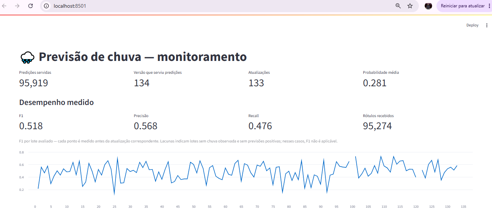

## Resultado principal

A estação usada é a MIA, em Miami, com dados do [Iowa Environmental Mesonet](https://mesonet.agron.iastate.edu/request/download.phtml). O dataset preparado contém 121.404 observações horárias, 16 features e cobre de 2012-02-01 a 2025-12-30. O alvo é `rain_next_hour`.

### Avaliação offline

O split é temporal: treino em 2012–2013, calibração do limiar em 2014 e teste final em 2015–2025. O teste foi usado uma única vez.

| Modelo | F1 | Precisão | Recall | ROC AUC |
|---|---:|---:|---:|---:|
| **MLP PyTorch** | **0,521** | 0,555 | 0,491 | **0,884** |
| Persistência | 0,492 | 0,491 | 0,493 | 0,731 |

O limiar final foi `0,87`, calibrado na validação de 2014. A linha de persistência representa a regra “se está chovendo agora, vai chover na próxima hora” e funciona como referência de sanidade. O ganho de F1 sobre a baseline foi de `+0,029`.

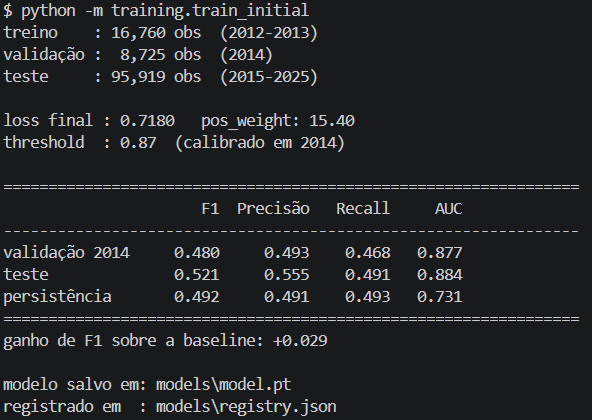

### Replay operacional

O replay percorreu os dados de 2015–2025 hora a hora, com os rótulos chegando em lotes a cada 30 dias. O modelo prediz primeiro, o lote é avaliado com o estado anterior e só depois os pesos são atualizados.

| Indicador | Resultado |
|---|---:|
| Período | 2015-01-01 a 2025-12-30 |
| Predições servidas | 95.919 |
| Atualizações incrementais | 133 |
| Versão final | **v134** |
| Rótulos recebidos | 95.274 |
| Probabilidade média | 0,281 |
| F1 acumulado | 0,518 |
| Precisão acumulada | 0,568 |
| Recall acumulado | 0,476 |
| Acurácia acumulada | 0,951 |

O replay demonstra o ciclo operacional e o versionamento de v1 a v134. Ele percorre o mesmo período do teste offline, portanto não é evidência independente de generalização para dados futuros. A diferença entre predições servidas e rótulos recebidos corresponde às observações que permaneceram no buffer final por não completarem uma janela de atualização de 30 dias.

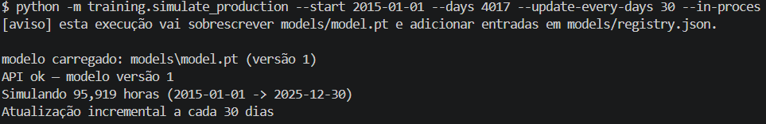

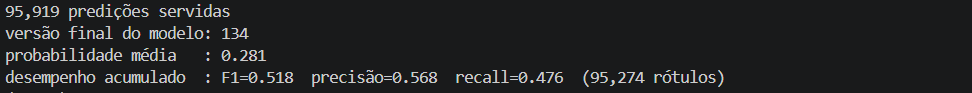

## Fluxo do sistema

```text
dados históricos → preparação → treino inicial v1 → API → predição
      → rótulo chega depois → /update → nova versão
      → registry e monitoramento → dashboard
```

| Etapa | Implementação | Função |
|---|---|---|
| Preparação | `training/prepare_data.py` | Converte o CSV do ASOS em dataset horário com 16 features |
| Treino inicial | `training/train_initial.py` | Ajusta o scaler, treina a rede, calibra o limiar e cria a v1 |
| Predição | `POST /predict` | Serve a probabilidade, o limiar, a classe e a versão |
| Atualização | `POST /update` | Avalia antes, aprende depois, salva o checkpoint e incrementa a versão |
| Versionamento | `models/registry.json` | Mantém o histórico operacional das versões |
| Monitoramento | `data/monitoring.db` + Streamlit | Registra eventos e mostra métricas de runtime |

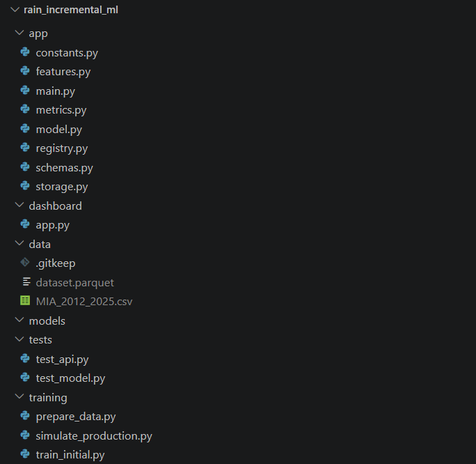

## Arquitetura

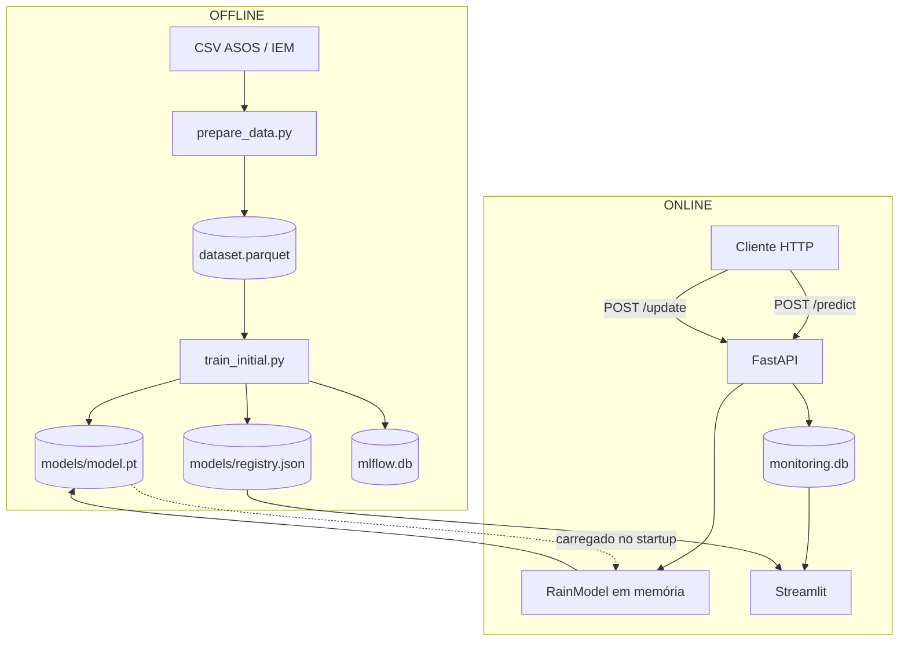

A API e o dashboard são serviços separados no Docker Compose. O dashboard lê o SQLite e o registry em modo somente leitura; não há chamada de rede entre os dois.

## Aprendizado incremental

O treino inicial cria a v1. Nas atualizações, o modelo é carregado com pesos, estado do Adam, scaler, limiar e metadados preservados. O mesmo modelo continua treinando com lotes novos, usando uma taxa de aprendizado menor e poucas épocas.

```python
# Treino inicial: começa do zero.
model = RainModel()
model.fit(dados_iniciais)

# Update: continua do estado persistido.
model = RainModel.load("models/model.pt")
model.incremental_fit(novos_dados)
model.save("models/model.pt")
```

A avaliação ocorre antes do treino em cada update. Assim, as métricas de uma entrada no registry descrevem a versão anterior sobre aquele lote, e não dados que o modelo acabou de estudar.

## Modelo e validação

```text
16 features → Linear(16) → ReLU → Linear(1) → logit
```

A rede tem 289 parâmetros. A loss do treino inicial terminou em `0,7180`, com `pos_weight = 15,40`. O scaler é ajustado uma vez e congelado. O split temporal evita vazamento entre períodos correlacionados.

### Divisão temporal

| Conjunto | Período | Observações | Uso |
|---|---|---:|---|
| Treino | 2012 e 2013 | 16.760 | Aprende os pesos |
| Validação | 2014 | 8.725 | Calibra o limiar de decisão |
| Teste | 2015 a 2025 | 95.919 | Avaliação final, usada uma única vez |

**Por que não usar split aleatório?** Embaralhar colocaria observações de períodos próximos em treino e teste. Como as horas vizinhas são correlacionadas, isso permitiria acesso indireto à resposta e produziria uma métrica otimista.

**Por que calibrar o limiar na validação?** Escolhê-lo olhando o teste transformaria o teste em treino e inflaria o resultado final.

## API

Documentação interativa: [localhost:8000/docs](http://localhost:8000/docs) localmente ou [Swagger público](https://rain-incremental-ml.onrender.com/docs).

| Endpoint | Descrição |
|---|---|
| `GET /health` | Status do processo e carregamento do modelo |
| `GET /model` | Versão, updates, limiar e arquitetura |
| `POST /predict` | Previsão para uma observação |
| `POST /update` | Update incremental com lote rotulado |
| `GET /metrics` | Métricas operacionais |
| `GET /versions` | Histórico de versões |

Exemplo de resposta do `POST /predict`:

```json
{
  "prediction": 0,
  "probability": 0.7506,
  "threshold": 0.87,
  "model_version": 1,
  "prediction_id": 1
}
```

### Validação pública

A API pública foi validada no Render com serviço em estado `Live`, health check acessível, documentação Swagger pública e uma chamada `POST /predict` retornando HTTP 200. A validação confirma o serving de inferência; ela não transforma o filesystem efêmero do plano gratuito em armazenamento persistente.

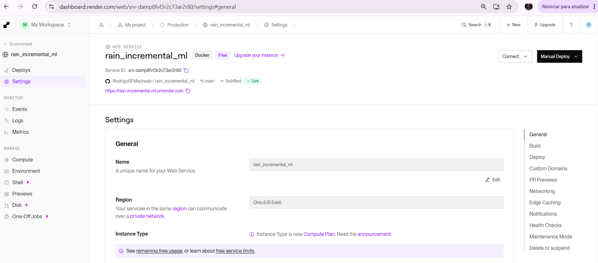

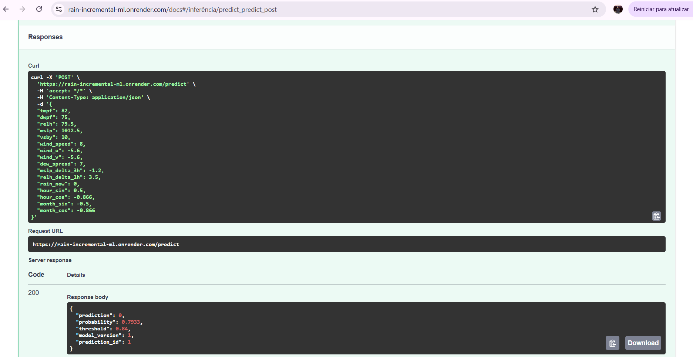

## Como executar

### Execução rápida com Docker

```bash
docker compose up -d --build --wait
docker compose ps
```

- API e Swagger: <http://localhost:8000/docs>
- Dashboard: <http://localhost:8501>

O `models/model.pt` está versionado para que a API suba com o baseline carregado. O replay modifica o checkpoint, o registry e o banco local; para voltar à v1, execute `python -m training.train_initial` ou restaure os artefatos do Git:

```bash
git restore models/model.pt models/registry.json
```

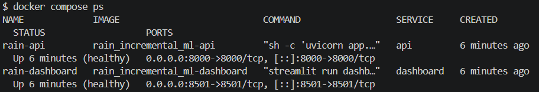

### Pipeline local completo

```bash
python -m venv .venv
source .venv/bin/activate
pip install torch --index-url https://download.pytorch.org/whl/cpu
pip install -r requirements-train.txt

# Baixe o CSV completo da estação MIA, de 2012 a 2025.
curl -L "https://mesonet.agron.iastate.edu/cgi-bin/request/asos.py?network=FL_ASOS&station=MIA&data=all&year1=2012&month1=1&day1=1&year2=2025&month2=12&day2=31&tz=Etc%2FUTC&format=onlycomma&latlon=no&elev=no&missing=M&trace=T&direct=no&report_type=3&report_type=4" \
  -o data/MIA_2012_2025.csv

# Prepare o dataset.
python -m training.prepare_data \
  --input data/MIA_2012_2025.csv \
  --start-year 2012

# Treine o modelo inicial.
python -m training.train_initial

# Execute o replay operacional.
python -m training.simulate_production \
  --start 2015-01-01 \
  --days 4017 \
  --update-every-days 30 \
  --in-process
```

O download usa `data=all` para manter o arquivo completo da estação. A seleção de variáveis, os filtros de qualidade, o tratamento de ausências, a criação do alvo `rain_next_hour` e a engenharia das 16 features são feitos pelo `training.prepare_data`, que funciona como fonte de verdade do processamento.

Para o dashboard local:

```bash
streamlit run dashboard/app.py
```

Os dados brutos e o dataset Parquet são ignorados pelo Git. Isso mantém o repositório leve e permite reconstruir o dataset a partir da fonte do IEM.

## Testes e validações

```bash
pytest tests/ -q
docker compose config --quiet
docker build -f Dockerfile -t rain-incremental-ml-api:ci .
```

O projeto possui integração contínua no GitHub Actions. A cada push ou pull request na branch `main`, o workflow configura Python 3.11, instala o PyTorch CPU e as dependências de treino e testes, executa a suíte automatizada, valida o Docker Compose e constrói a imagem da API.

A execução local foi validada com 20 testes aprovados, configuração do Docker Compose sem erros, build da imagem da API concluído, preparação do dataset 2012–2025, treino inicial, replay de 95.919 horas, 133 updates, versionamento de v1 a v134, dashboard operacional e predição pública HTTP 200.

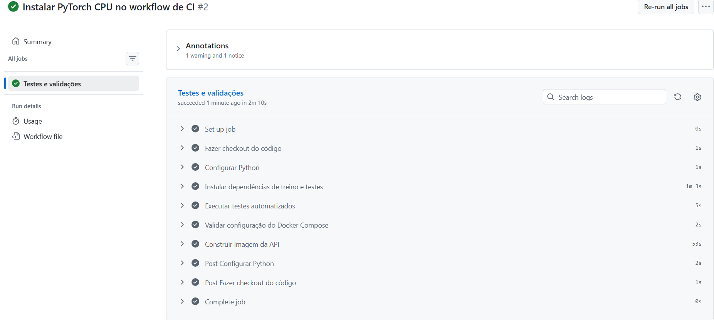

## Dados

Fonte: [Iowa Environmental Mesonet](https://mesonet.agron.iastate.edu/request/download.phtml), estação `MIA`, UTC, período de 2012-01-01 a 2025-12-31. O download programático completo está documentado na seção **Pipeline local completo**.

O dataset preparado efetivo contém dados de `2012-02-01 03:53:00` a `2025-12-30 22:53:00`, com 121.404 observações, 16 features e taxa positiva de 5,56%. Campos brutos podem variar conforme a resposta do IEM; o pipeline seleciona e transforma as colunas necessárias. O alvo é a ocorrência de chuva na próxima hora, protegida contra observações seguintes que não estejam aproximadamente uma hora à frente.

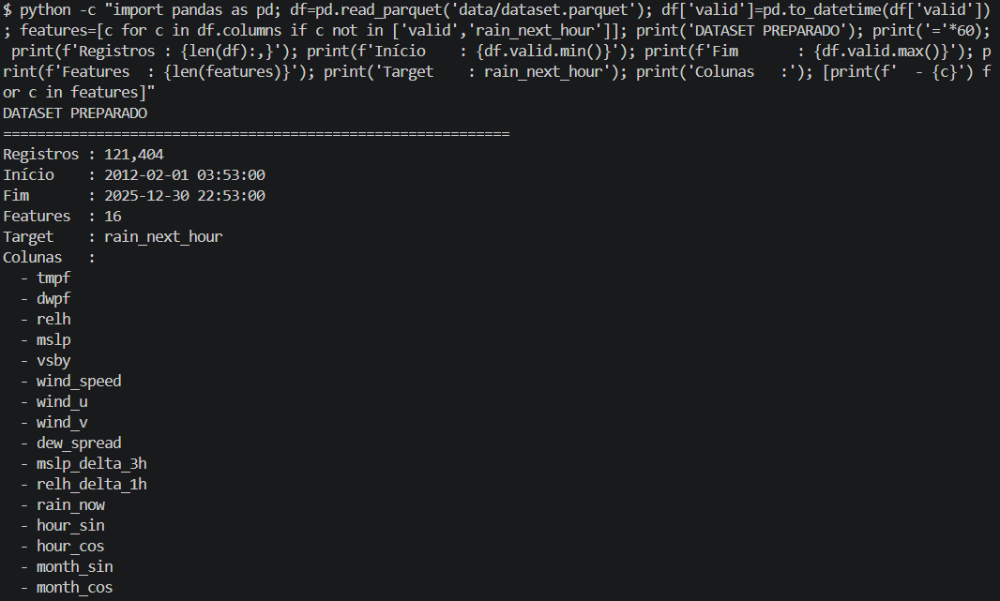

## Monitoramento

O SQLite registra predições, atualizações e avaliações. O dashboard mostra volume de tráfego, versão em uso, distribuição de probabilidades e desempenho acumulado. No replay final, foram registradas 95.919 predições, 95.274 rótulos, 133 updates e a versão v134. O desempenho acumulado foi F1 0,518, precisão 0,568 e recall 0,476.


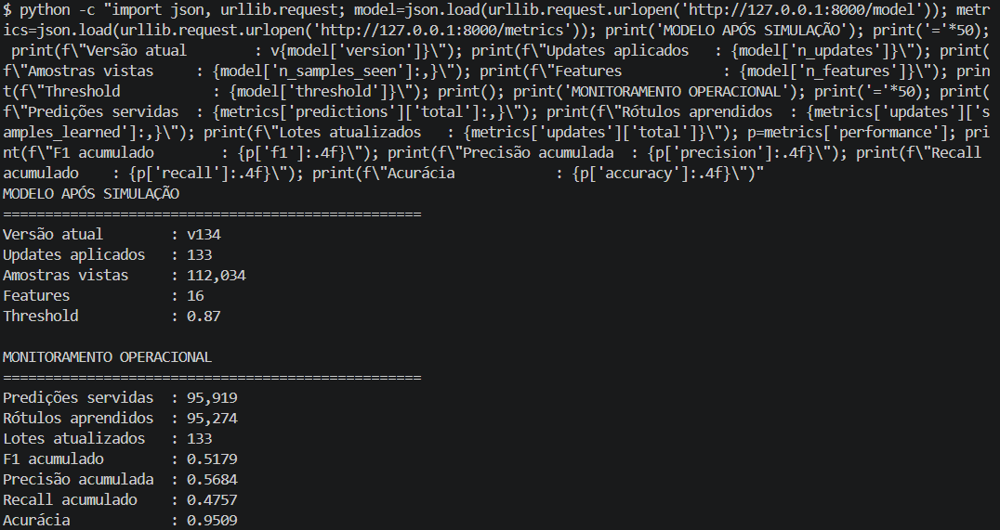

## Limitações

- O modelo usa uma única estação meteorológica em Miami; os resultados não se transferem automaticamente para outros climas.
- As saídas não são probabilidades calibradas em sentido absoluto. O `pos_weight` desloca a escala; `0,87` é um limiar de decisão, não “87% de chance de chuva”.
- O projeto não implementa detector automático de drift, alertas ou retreinamento agendado.
- A API usa um único worker porque o modelo é atualizado in-place.
- SQLite é adequado para demonstração local e baixa concorrência, não para múltiplas instâncias escrevendo simultaneamente.
- O filesystem do plano gratuito do Render é efêmero. O deploy público valida inferência, mas updates em runtime não oferecem persistência durável sem volume ou object storage.
- O replay histórico percorre o mesmo período do teste offline e não constitui uma avaliação independente de generalização.

## Estrutura do projeto

```text
app/          API FastAPI e RainModel
training/     preparação, treino inicial e simulação operacional
dashboard/    dashboard Streamlit
tests/        testes de API e continuidade incremental
models/       model.pt e registry.json versionados
data/         dados e SQLite locais, ignorados pelo Git
docs/images/  evidências visuais da execução
.github/      workflow de CI do GitHub Actions
Dockerfile · Dockerfile.dashboard · docker-compose.yml · render.yaml
```

## Próximos passos

- Calibração posterior das probabilidades, com Platt scaling ou isotônica.
- Endpoint `/ready` separado de `/health`.
- Aceitar timestamp no `/predict` e derivar variáveis temporais no servidor.
- Separar leitura e escrita para permitir múltiplos workers.
- Persistência de modelo e registry em volume ou object storage no deploy.
- Download automatizado do CSV do IEM.

## Licença

Este projeto está sob a [MIT License](LICENSE).  
© 2026 rain-incremental-ml authors.

Os dados meteorológicos são de domínio público, obtidos do Iowa Environmental Mesonet, mas verifique os termos da fonte antes de redistribuir o CSV bruto.
